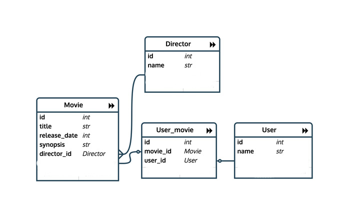

## SQL PRACTICE!!!!

### TO SET UP:

- Create a database (maybe `movies_dev` would be a good name)
- Run `psql -d [name of your database] -f schema.sql` from within this directory 
- Run `psql -d [name of your database] -f seed.sql` from within this directory

### ABOUT THIS DATABASE:

Here's what the database looks like:

There are 18 directors, 31 movies, 6 users, and 44 `user_movies`.

`user_movies` is a join table that represents which users would claim which movies as favorites. Each user can have many favorite movies, and each movie can be favorited by many users.

### PART 1: Basic SQL!

1. Add some movies! Add the title and synopsis of the last 5 movies you've seen that aren't already in the movies table. (If they have directors who aren't in the database, you'll have to add the directors as well!)
2. As you can see, there is a column for `release_date` in the movies table that hasn't been filled in yet. Add the release date of your 5 favorite movies in the movies table.
3. Delete 5 movies from the list you don't like. Like them all? Add 5 movies that are total flops and then delete those suckers 😝.
4. Add yourself as a user and create records in `users_movies`  to record your favorites.

### PART 2: Joins!

1. Select all the movies directed by Alex Garland.
2. Find the director who directed "There Will Be Blood".
3. Find all of J's favorites.
4. Find everyone who added 'The Shining' as a favorite movie.
5. List all the movie titles and their corresponding directors.
6. Select the movie title and user name for all of the "favorites" represented by the users_movies table.

### PART 3: Advanced Queries!

These are gonna be hard. Make sure to use your friend google as a resource.

1. List the movies with the number of favorites they have.
2. List the names of directors along with the number of favorites that exist for all of the movies they've made, ordered by number of favorites descending.
3. List the user name, director name and favorite count of all of the user/director combinations (based on the users_movies table).
4. Find the favorite director -- the director whose movies have the most favorites.
